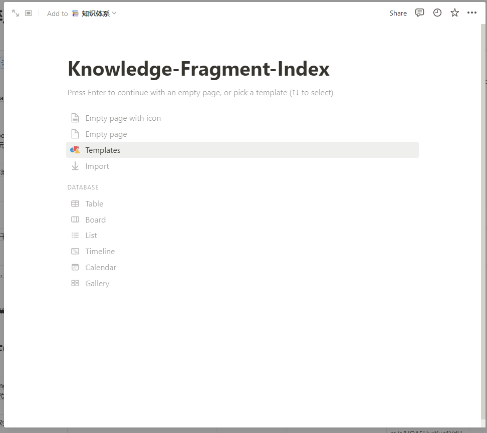
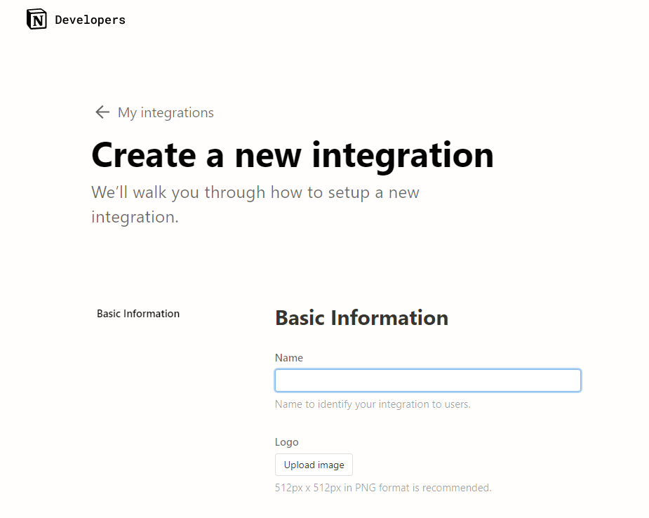
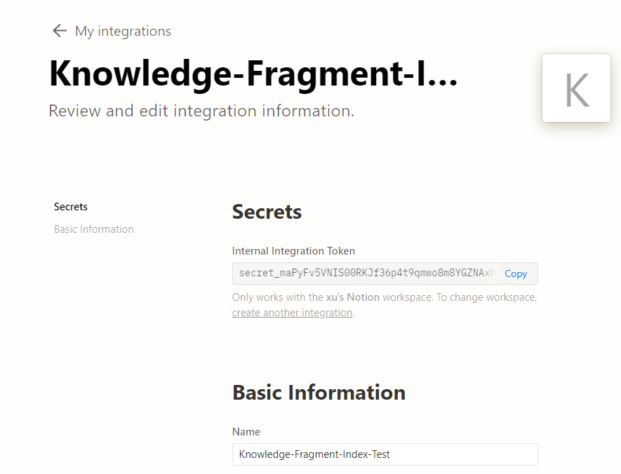
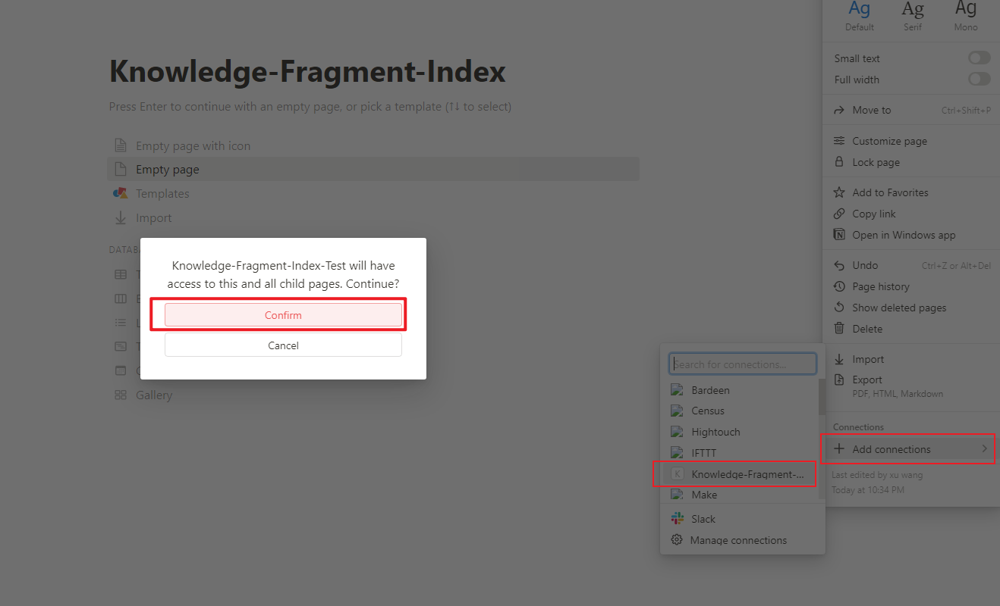
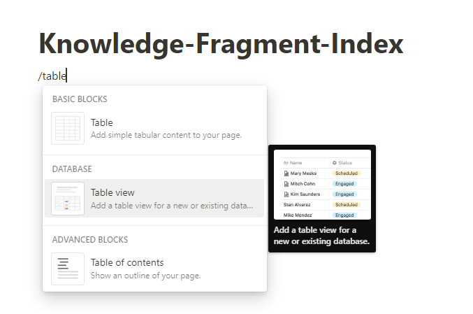
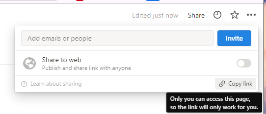
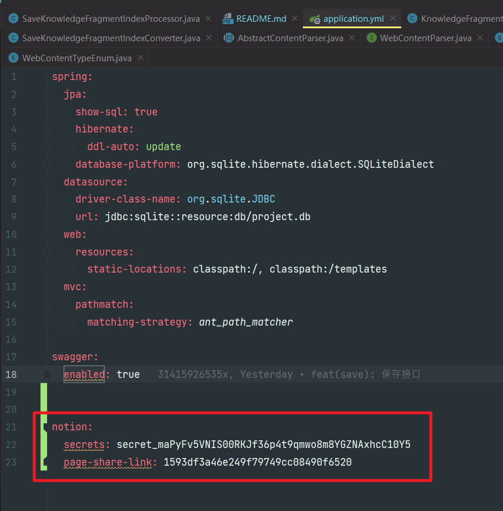

# Knowledge-Fragment-Index

收口并同步所有碎片化的知识来源到notion等地方-（对标notion助手）

# 食用方式

## notion

+ 在notion中新建一个 page:
  
+ 新建一个 integration:
+ copy access token: 
+ 回到page，添加刚刚创建的 integration: 
+ 为了能够访问到db，需要手动新增一个db: 
+ share获取到当前页面的link: 
+ link的格式是这样的: ``https://www.notion.so/1593df3a46e249f79749cc08490f6520?v=0cae032112d2456783739099fac0776c``;
  我们只需要当前页面实际的uuid，即： ``1593df3a46e249f79749cc08490f6520``
+ 将这两个key放置到 ``application.yml`` 中的配置里: 

## 前端页面生成

我目前是会将 build 之后的前端页面push到git上，但是为了保险起见 建议在 ``git clone`` 之后，在手动build一下：

```bash
cd xxx/webapp
yarn build
```

## maven 打包

使用maven打包出jar包即可上传到 vps 运行提供服务